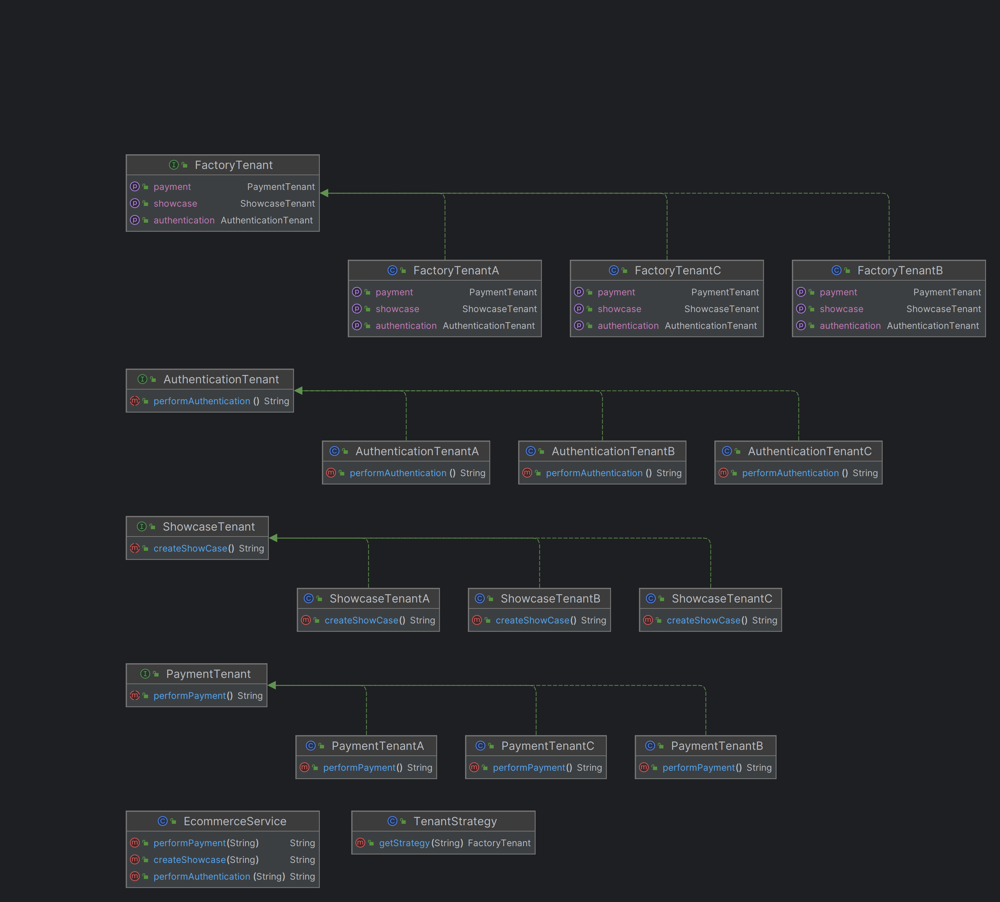

# Tenant Rule Segregator (TRS)

[](https://sonarcloud.io/summary/new_code?id=Joao-Lucas-de-Oliveira-Lima_software-reuse-pattern)


O **Tenant Rule Segregator (TRS)** é uma solução para sistemas de e-commerce multitenant que permite a segregação de regras de negócio específicas por tenant (cliente), garantindo flexibilidade, escalabilidade e manutenção simplificada.

---

## 📋 Descrição do Problema

Em sistemas multitenant, cada tenant pode ter regras de negócio únicas, como:
- **Processamento de compras**: Descontos, formas de pagamento ou validações específicas.
- **Configuração da vitrine**: Número de itens exibidos, layout, ordem das seções, etc.
- **Autenticação de usuários**: Provedores de autenticação específicos.

A mistura dessas regras em um único fluxo de código resulta em:
- Alta complexidade.
- Dificuldade de manutenção.
- Problemas de escalabilidade.

---

## 🛠️ Descrição da Solução

O TRS resolve esses problemas através de:
1. **Isolamento de Lógica**: Cada tenant possui módulos específicos para compras, vitrine e autenticação.
2. **Centralização do Despacho**: Um componente central (`Dispatcher`) direciona as requisições para as implementações corretas com base no tenant.
3. **Extensibilidade**: Contratos (interfaces ou classes base) permitem adicionar novos tenants sem modificar o núcleo do sistema.
4. **Flexibilidade**: Cada tenant implementa suas regras de negócio de forma independente, evitando conflitos e facilitando ajustes.

---

## 🗂️ Diagrama de Classes



---

## 🚀 Como Executar

### Pré-requisitos
- **Java JDK 21**

### Iniciando a Aplicação
No diretório raiz do projeto, execute:
```bash
./mvnw spring-boot:run
```
>A aplicação será iniciada na porta 8080 por padrão.

### Usando

Acesse os endpoints da aplicação utilizando um dos subdomínios abaixo:
```text
GET http://tenanta.localhost:8080/api/v1/payment

GET http://tenantb.localhost:8080/api/v1/auth

GET http://tenantc.localhost:8080/api/v1/showcase
```
Qualquer outro subdomínio resultará em um erro.
#### Resposta Esperada
A aplicação retornará uma resposta no formato JSON, indicando a estratégia utilizada com base no tenant fornecido:
```json
{
  "message": "text"
}
```

## 🧪 Testes
### Executando Testes de Integração
Para executar os testes, utilize o comando:
```bash
./mvnw verify
```

### Gerando Relatório de Cobertura
Para obter um relatório detalhado da cobertura de testes, execute:
```bash
./mvnw verify jacoco:report
```
O relatório será gerado em `target/site/index.html`.

## 🧠 Explicação Técnica
O TRS utiliza os seguintes padrões de design:

= Abstract Factory: Agrupa funcionalidades relacionadas a um tenant em uma única classe, com contratos definidos por interfaces.

= Strategy: Fornece uma fábrica específica para cada tenant, permitindo a seleção dinâmica da lógica apropriada.

Essa abordagem garante um código reutilizável, escalável e de fácil manutenção, embora com uma complexidade moderada.